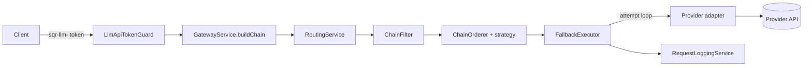

# Architecture

The Free LLM Gateway is a NestJS server (management API + OpenAI-compatible gateway) with a
SvelteKit SPA dashboard, backed by a pluggable Drizzle database layer.

## Overview

```
apps/
  server/   NestJS API — management (/api/v1, JWT) + OpenAI-compatible gateway (/v1, LLM token)
    src/database/   Drizzle schema, pluggable providers (Postgres/SQLite), connection + migrations
  client/   SvelteKit SPA dashboard (calls /api/v1 only)
packages/
  shared-types/       DTOs shared between server and client
  provider-adapters/  Provider adapter hierarchy + registry (framework-agnostic)
```

## Key principles

- **Dependency direction:** `controller → service → repository → DatabaseService`. One-way; no DB
  access in controllers, no business logic in controllers.
- **Open/Closed:** new provider = adapter subclass + `AdapterRegistry` entry + seed row; new routing
  strategy = strategy class + `RoutingStrategyFactory` entry; new DB provider =
  `apps/server/src/database/providers/<name>/` folder + one `providerRegistry` line. Core untouched.
- **Two auth surfaces:** `JwtAuthGuard` guards `/api/v1`; the `LlmApiTokenGuard` (hashed `sqr-llm-`
  tokens) guards `/v1`. Never merged — `/v1` rejects JWTs and `/api/v1` rejects LLM tokens.

## Request flow (gateway `/v1/chat/completions`)



1. **Strategy resolution** — `X-Routing-Strategy` header → the user's default → `balanced`.
2. **Capability gating** — `capsOf` derives required capabilities (vision/tools/json); an empty
   capable chain returns `422 no_capable_model`.
3. **Chain build** — `CandidateLoader` assembles `(model, provider, key)` candidates with live
   signals; `ChainFilter` drops unavailable/incapable ones; the selected strategy orders them.
4. **Fallback execution** — `FallbackExecutor` tries candidates in order; on `429`/`5xx`/timeout it
   cools the key down and advances (up to `MAX_FALLBACK_ATTEMPTS`), recording usage + runtime stats.
5. **Headers + logging** — responses carry `X-Routed-Via: <provider>/<model>` and, on fallback,
   `X-Fallback-Attempts: <N>`; `RequestLoggingService` writes a `request_logs` row with cost-saved.

## Subsystems

- **Provider adapters:** `BaseLlmProviderAdapter` → `OpenAiCompatibleAdapter` → concrete providers
  (Gemini/HuggingFace extend the base or compat layer directly). See
  [adding-a-provider.md](./adding-a-provider.md).
- **Routing engine:** `RoutingCandidate` value objects + the Strategy pattern; `ChainFilter` →
  `ChainOrderer` → `FallbackExecutor`. See [routing-strategies.md](./routing-strategies.md).
- **Rate limiting:** in-memory `RateLimitService` / `CooldownService` / `RuntimeStatsService`, backed
  by the `rate_limit_counters` / `cooldowns` / `model_runtime_stats` ledgers.
- **Analytics:** the append-only `request_logs` ledger drives `/api/v1/analytics` and the headline
  cost-saved metric.
- **Security model:** AES-256-GCM key encryption, SHA-256 token hashing, Argon2id passwords,
  refresh-token rotation, per-user isolation. See [security.md](./security.md).
